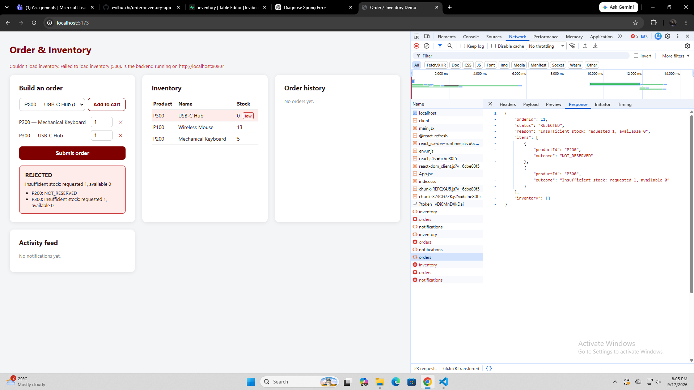

# Order / Inventory In-Process Integration Demo — Lab 2

A single Spring Boot application with three in-process modules — **Order**
(`edu.cit.berou.shop`), **Inventory** (`edu.cit.berou.inventory`), and
**Notification** (`edu.cit.berou.notification`) — sharing a Supabase
(Postgres) database, plus a React (Vite) frontend that talks to it over
REST.

Lab 2 extends the Lab 1 single-item demo with: multi-item orders with
all-or-nothing rollback, order cancellation with restock, read endpoints for
live inventory/order data, an in-process event-driven Notification module,
and a low-stock auto-reorder rule.

## Project structure

```
order-inventory-app/
├── backend/     Spring Boot app (Java 17, Spring Boot 3.5.5)
├── frontend/    React + Vite app
├── sql/         schema.sql - table creation + seed data (run this first)
└── README.md
```

## 1. Supabase setup

1. Go to [supabase.com](https://supabase.com), sign in, and open your
   project (or create a new one).
2. Project Settings → Database → note your **Session pooler** connection
   string (or direct connection URI).
3. Open **SQL Editor → New query**, paste the contents of `sql/schema.sql`,
   and run it. This drops and recreates `inventory`, `orders`,
   `order_items`, and `notifications` from scratch, including seed data —
   safe to re-run any time you want a clean slate.

## 2. Backend setup

```bash
cd backend
export SUPABASE_DB_URL="jdbc:postgresql://<host>:<port>/postgres"
export SUPABASE_DB_USERNAME="postgres.<project-ref>"
export SUPABASE_DB_PASSWORD="<your-db-password>"
export CORS_ALLOWED_ORIGIN="http://localhost:5173"   # optional, this is the default
./mvnw spring-boot:run
```

(On Windows PowerShell, use `$env:SUPABASE_DB_URL = "..."` etc., or set them
in your IDE's run configuration.) See `backend/.env.example` for the full
list of variables. The API comes up on `http://localhost:8080`.

## 3. Frontend setup

```bash
cd frontend
npm install
npm run dev
```

Opens on `http://localhost:5173`. Set `VITE_API_BASE_URL` in
`frontend/.env` if the backend isn't on the default `localhost:8080`.

## 4. API

| Method | Path                        | Description                                   |
|--------|-----------------------------|------------------------------------------------|
| POST   | `/api/orders`                | Place a multi-item order (all-or-nothing)      |
| GET    | `/api/orders`                | Order history, newest first, with line items   |
| POST   | `/api/orders/{orderId}/cancel` | Cancel a confirmed order and restock its items |
| GET    | `/api/inventory`             | Current stock for every product                |
| GET    | `/api/notifications`         | Activity feed (confirmations, rejections, low-stock alerts) |

`POST /api/orders` request body:

```json
{ "items": [{ "productId": "P100", "quantity": 2 }, { "productId": "P200", "quantity": 1 }] }
```

Response:

```json
{
  "orderId": 12,
  "status": "CONFIRMED",
  "reason": null,
  "items": [{ "productId": "P100", "outcome": "RESERVED" }, { "productId": "P200", "outcome": "RESERVED" }],
  "inventory": [{ "productId": "P100", "name": "Wireless Mouse", "stock": 23 }, { "productId": "P200", "name": "Mechanical Keyboard", "stock": 9 }]
}
```

On rejection, `inventory` is empty (nothing was reserved) and each failing
line item's `outcome` carries its specific reason; items that passed
validation but weren't reserved (because a sibling item failed) show
`"NOT_RESERVED"`.

## 5. Network tab evidence

> **Not yet captured — this section is a placeholder.** These screenshots
> have to come from an actual run against your Supabase database; they
> can't be generated without executing the app, so they're still on you.
> Steps to capture each one:
>
> 1. Start the backend and frontend (sections 2–3 above).
> 2. Open browser DevTools → **Network** tab, filter by `orders`,
>    `inventory`, or `notifications` as relevant.
> 3. Perform the action in the UI, click the resulting request, and
>    screenshot the **Payload** and **Response** panels.
> 4. Save each screenshot under `docs/` and reference it below.

- [ ] **All items succeed (CONFIRMED).** Add 2+ products to the cart,
      submit, confirm the response shows `"status": "CONFIRMED"` and every
      item `"RESERVED"`.
      `docs/network-multi-confirmed.png`
- [ ] **One item fails → whole order REJECTED, no partial reservation.**
      Add one product with a quantity above its current stock alongside a
      valid item, submit, confirm `"status": "REJECTED"` and — critically —
      re-check `GET /api/inventory` afterward to confirm the *valid* item's
      stock did **not** decrease either.
      `docs/network-multi-rejected.png`
- [ ] **Cancel + restock.** Cancel a confirmed order from the order history
      panel, then screenshot `GET /api/inventory` showing the cancelled
      order's stock restored.
      `docs/network-cancel-restock.png`
- [ ] **Notification feed.** Screenshot `GET /api/notifications` (or the
      Activity feed panel) after triggering all three entry types: a
      confirmed order, a rejected order, and a low-stock alert (order enough
      of one product to push it under `app.inventory.low-stock-threshold`,
      default 5).
      `docs/network-notifications.png`

## 6. Reflection

**1. Keeping multi-item orders atomic in-process, and what changes over a
network.**

`OrderService.placeOrder()` and `InventoryService.reserve()` are both
`@Transactional`, and Spring's default propagation (`REQUIRED`) means each
`reserve()` call inside the item loop joins the *same* transaction the
outer method opened rather than starting its own. If a reservation still
fails after validation passed (a race with another order), I throw, and
that rolls back every reservation already made earlier in the loop plus
the order itself — nothing partially commits. The up-front validation pass
makes this rare; the transaction is the safety net for the race window,
not the primary mechanism. Over a network, that shared transaction
disappears — there's no single connection spanning two services. I'd need
either a saga (reserve items individually, issue compensating "release"
calls if a later one fails — what the in-process rollback does for free
now) or an outbox pattern where the order is confirmed only once every
reservation reports back, with timeouts and retries for a non-responding
service.

**2. Event coupling to Notification vs. a direct call.**

`OrderService` never imports anything from `edu.cit.berou.notification` —
it publishes `OrderPlacedEvent`/`OrderRejectedEvent` via
`ApplicationEventPublisher`, and `OrderEventListener` in Notification
listens with `@EventListener`. That's a one-way dependency: Notification
could be deleted or rewired without touching Order's logic. Listeners run
synchronously today, inline in the same transaction as the publisher, so a
notification only persists if the order's transaction commits — I kept
this deliberately, so the log never shows a confirmation that later rolled
back. If I wanted it non-blocking I'd use
`@TransactionalEventListener(phase = AFTER_COMMIT)` instead of plain
`@Async`, to keep that guarantee. If Notification became its own service,
in-process events wouldn't reach it — I'd need a message broker (e.g.
RabbitMQ/Kafka), at-least-once delivery with an idempotent listener, and
an outbox table so publishing the event and committing the order write
stay atomic even though the broker call isn't part of the DB transaction.

**3. Which module to extract first.**

I'd pick **Notification**. It already has the weakest coupling — Order and
Inventory only publish events and don't know it exists — so extracting it
doesn't force a redesign of the other two modules. Inventory sits on every
order's critical path and depends on sharing a transaction with Order via
its pessimistic lock; pulling it out first means solving the distributed-
transaction problem from question 1 immediately. Extracting Notification
just means swapping the in-process `@EventListener` for a queue consumer
(via an outbox) — the order/cancel write path doesn't change at all.

## Submission checklist

- [ ] Push this repo to GitHub (confirm `.env` files are **not** committed —
      check with `git status` / `.gitignore`)
- [ ] Run `sql/schema.sql` against Supabase and confirm the app starts
      cleanly against it
- [ ] Capture the four Network tab screenshots in Section 5 and add them
      under `docs/`
- [ ] Review the reflection in Section 6 — it's a draft grounded in the
      actual code, but put it in your own words before submitting, the same
      way you did for the Lab 1 reflection
- [ ] Fill in your actual GitHub repo link when submitting


Monolith Lab:
Test and capture Network tab evidence for:
A multi-item order where all items succeed (CONFIRMED)
-

A multi-item order where one item fails and the whole order is REJECTED with no partial reservation
-

A cancel with restock reflected in GET /api/inventory afterward
-

The notification feed showing a confirmed order, a rejected order, and a low-stock alert